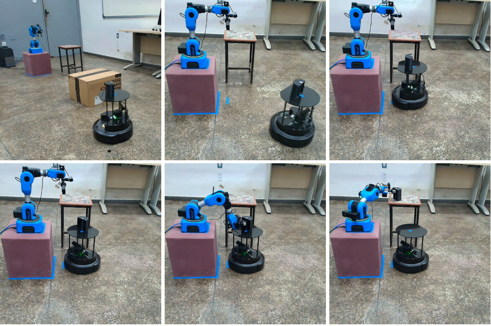

# Cooperação entre Niryo Ned2 e TurtleBot4 para Tarefas de Pick and Place

Este repositório apresenta a implementação de uma aplicação real voltada à cooperação entre o robô móvel TurtleBot4 e o braço robótico Niryo Ned2 para a execução de tarefas de manipulação de objetos.

O sistema integra navegação móvel, percepção visual e manipulação robótica. O TurtleBot4 é responsável por transportar o objeto até a região de cooperação próxima ao manipulador, enquanto o Niryo Ned2 realiza a tarefa de pick and place. Para aumentar a viabilidade da apreensão de objetos assimétricos, foi implementado um algoritmo de reorientação do robô móvel, responsável por buscar uma orientação mais favorável do objeto em relação ao manipulador.


- Demonstração da execução da aplicação real, envolvendo a cooperação entre o TurtleBot4 e o Niryo Ned2 durante a tarefa de pick and place.: 
<p align="center">
  
</p>


---

## Índice

* [Arquitetura do Sistema](#arquitetura-do-sistema)
* [Pré-requisitos](#pré-requisitos)
* [Instalação](#instalação)
* [Execução](#execução)

---

## Arquitetura do Sistema

O sistema é baseado na comunicação entre diferentes nós ROS 2, responsáveis pelas etapas de navegação, percepção, planejamento de movimento e manipulação.

O fluxo de execução ocorre da seguinte forma:

1. O TurtleBot4 navega até a região de cooperação transportando o objeto a ser manipulado.
2. A câmera acoplada ao manipulador identifica a AprilTag posicionada sobre o objeto.
3. A pose do objeto é estimada e utilizada para atualizar a cena de planejamento no MoveIt 2.
4. O MoveIt 2 avalia a viabilidade da apreensão considerando a orientação atual do objeto.
5. Caso a apreensão não seja viável, o algoritmo de reorientação busca uma nova orientação para o TurtleBot4.
6. Quando uma orientação viável é encontrada, o TurtleBot4 realiza o reposicionamento físico no ambiente real.
7. O Niryo Ned2 executa a tarefa de pick and place.

Essa arquitetura permite que o robô móvel e o manipulador atuem de forma cooperativa, aumentando a flexibilidade da manipulação em tarefas envolvendo objetos assimétricos.

---

## Pré-requisitos

Antes de começar, certifique-se de que você tenha os seguintes softwares instalados e configurados:

- [ROS2 Jazzy](https://docs.ros.org/en/jazzy/Installation.html) (Ubuntu 24.04)
- Python 3
- RViz2
- [MoveIt2](https://moveit.picknik.ai/main/doc/tutorials/getting_started/getting_started.html)

---

## Instalação

Siga os passos abaixo para configurar o ambiente e instalar todas as dependências necessárias:

1. Clone este repositório dentro do seu workspace ROS2. 

    ```bash
    cd ~/ros2_ws/src
    git clone https://github.com/agloiola/cooperation_ned2_turtlebot4.git
    ```

2. Instale o pacote do driver ROS2 do NED2, responsável pelo controle do braço robótico:

    ```bash
    cd ~/ros2_ws/src
    git clone https://github.com/NiryoRobotics/ned-ros2-driver.git
    ```

3. Instale os pacotes do TurtleBot4:

    ```bash
    cd ~/ros2_ws/src
    git clone https://github.com/turtlebot/turtlebot4.git
    ```

4. Instale o pacote `usb_cam`, utilizado para acessar a câmera conectada ao sistema:

    ```bash
    cd ~/ros2_ws/src
    git clone https://github.com/ros-drivers/usb_cam.git
    ```

5. Para a detecção da posição do objeto, instale o pacote `apriltag_ros`:

    ```bash
    cd ~/ros2_ws/src
    git clone https://github.com/christianrauch/apriltag_ros.git
    ```

6. Após instalar todos os pacotes, compile o workspace e carregue o ambiente do ROS2:

    ```bash
    cd ~/ros2_ws
    colcon build
    source install/setup.bash
    ```
    
---

## Execução

Antes de iniciar a execução do sistema, certifique-se de que os robôs estejam ligados, configurados corretamente para comunicação com o computador e com o horário sincronizado com o sistema.

Nos experimentos deste projeto, a conexão foi realizada da seguinte forma:

- o TurtleBot4 foi conectado ao computador por meio do Wi-Fi (hotspot);
- o NED2 foi conectado via rede Ethernet;
- o computador também foi conectado à rede Ethernet, garantindo que ambos estivessem na mesma rede.

Também é importante verificar se o arquivo de configuração do driver do NED2 está corretamente preenchido com o endereço IP do robô. O arquivo utilizado é:

```bash
~/ros2_ws/src/ned-ros2-driver/niryo_ned_ros2_driver/config/drivers_list.yaml
````

---

1. Inicialização da câmera e detecção da tag

    O primeiro passo da execução é iniciar a câmera e o processo de detecção da tag utilizada para identificar a posição do objeto no ambiente:

    ```bash
    ros2 launch cooperation_ned2_turtlebot4 image_camera_tag.launch.py
    ```

2. Inicialização do driver do NED2

    Em um novo terminal, execute o driver do robô:
    
    ```bash
    ros2 launch niryo_ned_ros2_driver driver.launch.py
    ```

    Em outro terminal, inicie o MoveIt2:
    
    ```bash
    ros2 launch niryo_ned2_moveit_config ned2_moveit_launch.py
    ```

3. Inicialização do TurtleBot4
    
    Em um novo terminal, execute:
    
    ```bash
    export RMW_IMPLEMENTATION=rmw_fastrtps_cpp
    unset FASTRTPS_DEFAULT_PROFILES_FILE
    export ROS_DOMAIN_ID=0
    export ROS_LOCALHOST_ONLY=0
    
    ros2 daemon stop
    ros2 daemon start
    
    ros2 launch cooperation_ned2_turtlebot4 turtlebot4_navigation_full.launch.py
    ```
    
    Este launch realiza a inicialização da navegação do TurtleBot4, incluindo localização, planejamento de caminho e visualização.

4. Inicialização da Cooperação
    
    Por fim, em um novo terminal, execute o launch de cooperação, responsável pela execução da tarefa de pick and place, leitura da posição do objeto, navegação e reorientação do TurtleBot4:
    
    ```bash
    ros2 launch cooperation_ned2_turtlebot4 cooperation_ned2_turtlebot4.launch.py
